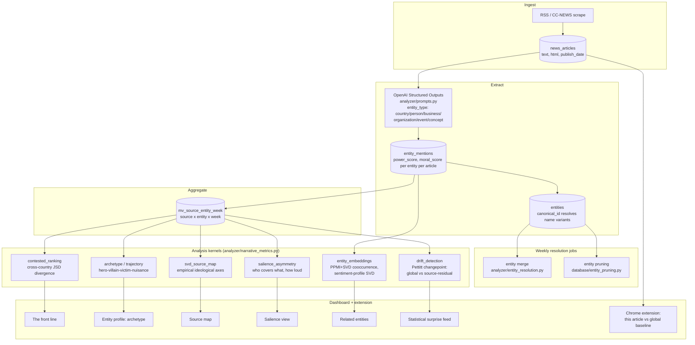

# News Bias Analyzer

A non-judgmental computational framework for analyzing global news sentiment patterns.
LLMs extract entity-sentiment tuples (power and moral dimensions, −2..+2) from articles
scraped across ~124 global sources; statistics do all comparative analysis — the system
reveals divergence between information spheres without declaring anyone "biased."

See [CLAUDE.md](CLAUDE.md) for the project philosophy.

## Components

- **Pipeline**: RSS scraping → OpenAI Batch API entity-sentiment extraction →
  Postgres/TimescaleDB
- **Dashboard**: React + Vite web frontend (`frontend/`)
- **Extension**: Chrome extension (Manifest V3) analyzing the article you're reading
  against global baselines (`extension/`)

## Pipeline: from article to signal



Each kernel in the diagram is a pure, self-tested function (`python -m analyzer.narrative_metrics`)
over `mv_source_entity_week` or `entity_mentions` — no manual review or human-in-the-loop step
anywhere in the pipeline, by design (see [CLAUDE.md](CLAUDE.md)). `analyzer/event_study.py` is a
standalone, read-only script (not part of the live pipeline) that checks the project's founding
axiom — "sentiment moves in lockstep during real global events" — against the actual corpus.

## Quick start

```bash
cp .env.example .env         # set your OPENAI_API_KEY
./run.sh docker up           # start the TimescaleDB container
./run.sh docker init         # create tables / run migrations
./run.sh scraper             # scrape articles
./run.sh analyze daemon      # analyze via OpenAI Batch API
./run.sh server              # start the API servers
./run.sh dashboard           # start the frontend dev server
```

`./run.sh help` lists all commands.

## Documentation

- [State of the Project (2026)](docs/STATE_OF_PROJECT_2026.md) — current reality,
  cleanup log, deferred work, deployment plan
- [Seeding & Models](docs/SEEDING_AND_MODELS.md) — bulk datasets for backfilling
  history, model pricing, local-model options
- [Setup and Running](docs/SETUP_AND_RUNNING.md)
- [Architecture](docs/ARCHITECTURE.md)
- [Full documentation index](docs/README.md)
