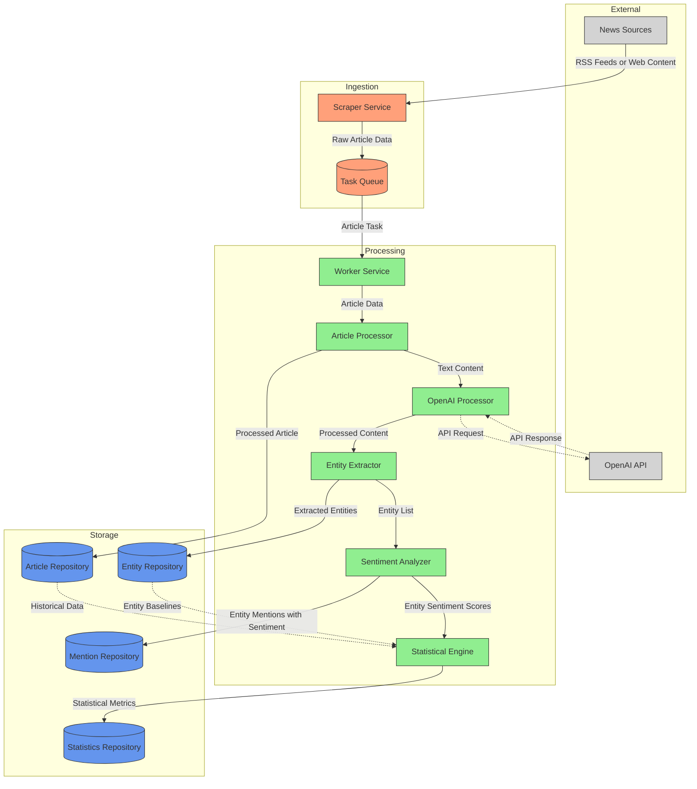
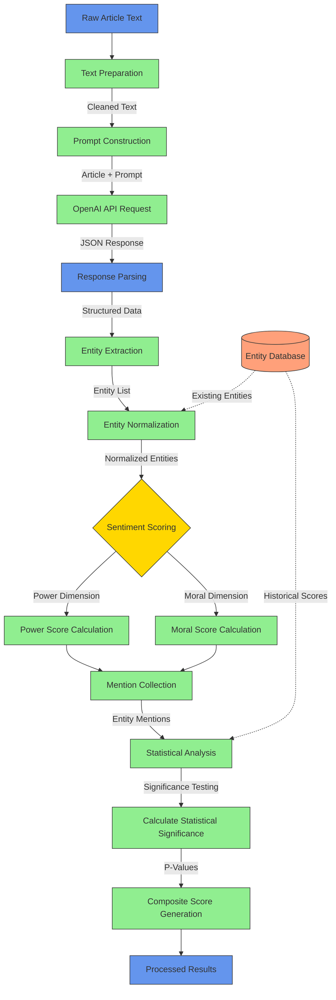
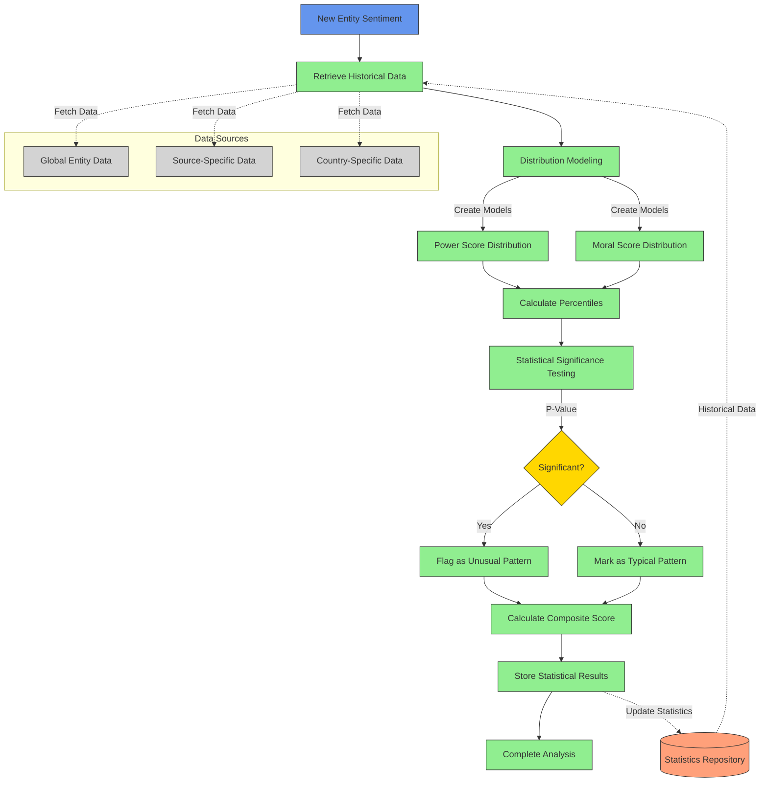
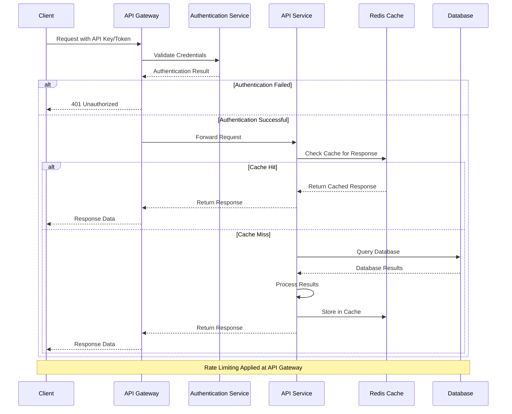
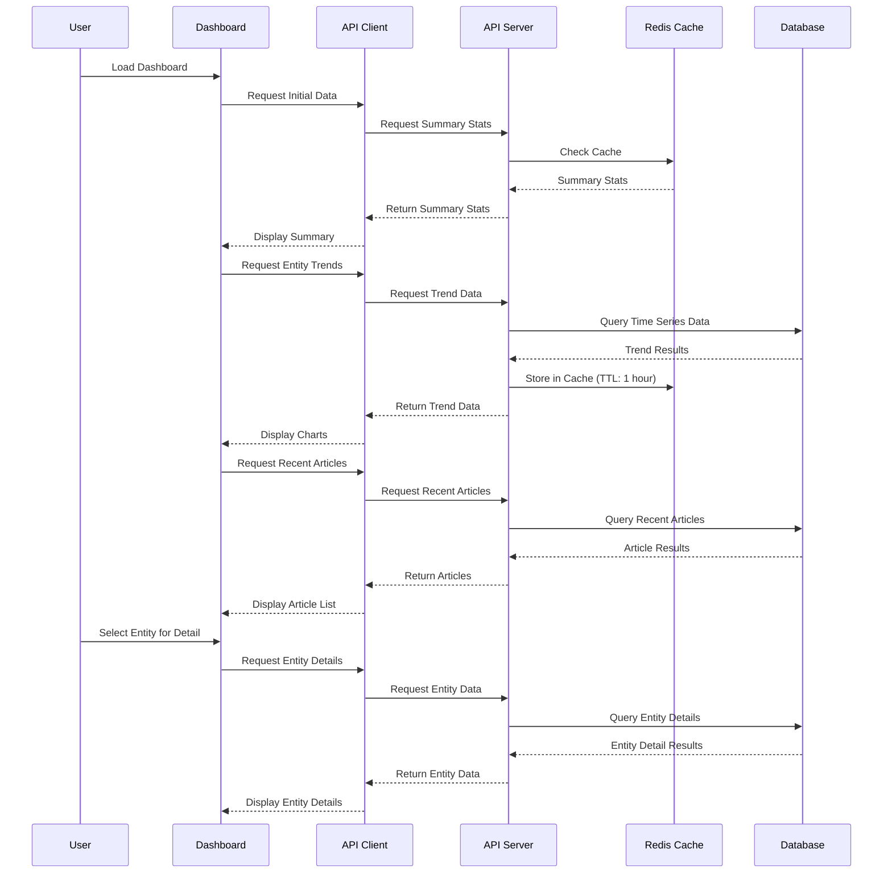
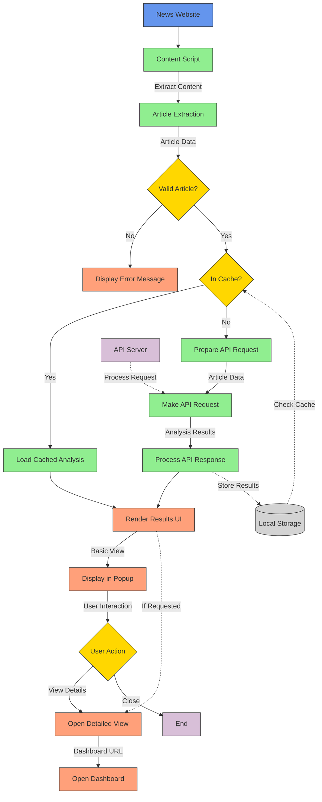
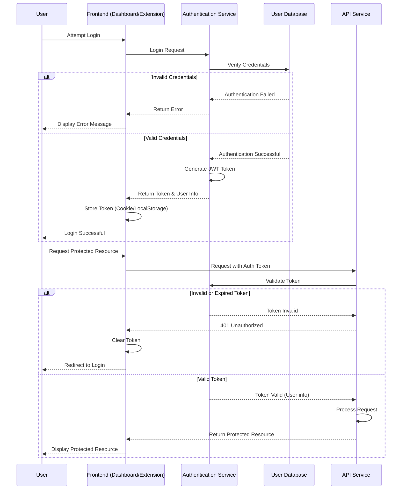

# News Bias Analyzer - Data Flow Diagrams

This document contains detailed data flow diagrams showing how information moves through the News Bias Analyzer system.

## Article Processing Data Flow



## Sentiment Analysis Pipeline



## Entity Resolution Process

```mermaid
flowchart LR
    NewEntity[New Entity] --> NameNormalization[Name Normalization]
    NameNormalization -->|Normalized Name| EntityLookup{Existing Entity?}
    
    EntityLookup -->|Yes| ExactMatch[Exact Match Processing]
    EntityLookup -->|No| SimilarityCheck{Check Similar Entities}
    
    SimilarityCheck -->|Found Similar| FuzzyMatch[Fuzzy Match Processing]
    SimilarityCheck -->|No Match| CreateNew[Create New Entity]
    
    ExactMatch -->|Update Stats| UpdateEntityStats[Update Entity Statistics]
    FuzzyMatch -->|Merge or Link| EntityMerge[Entity Merge/Link]
    CreateNew -->|New Record| SaveEntity[Save New Entity]
    
    UpdateEntityStats --> FinalizeEntity[Finalize Entity Processing]
    EntityMerge --> FinalizeEntity
    SaveEntity --> FinalizeEntity
    
    subgraph "Similarity Metrics"
        StringSimilarity[String Similarity]
        ContextSimilarity[Context Similarity]
        TypeConsistency[Type Consistency]
    end
    
    SimilarityCheck -.->|Check Methods| StringSimilarity
    SimilarityCheck -.->|Check Methods| ContextSimilarity
    SimilarityCheck -.->|Check Methods| TypeConsistency
    
    EntityDB[(Entity Repository)] -.->|Existing Records| EntityLookup
    EntityDB -.->|Similar Entities| SimilarityCheck
    FinalizeEntity -.->|Store Results| EntityDB
    
    classDef input fill:#6495ED,stroke:#333,stroke-width:1px;
    classDef process fill:#90EE90,stroke:#333,stroke-width:1px;
    classDef decision fill:#FFD700,stroke:#333,stroke-width:1px;
    classDef storage fill:#FFA07A,stroke:#333,stroke-width:1px;
    classDef metrics fill:#D3D3D3,stroke:#333,stroke-width:1px;
    
    class NewEntity input;
    class NameNormalization,ExactMatch,FuzzyMatch,CreateNew,UpdateEntityStats,EntityMerge,SaveEntity,FinalizeEntity process;
    class EntityLookup,SimilarityCheck decision;
    class EntityDB storage;
    class StringSimilarity,ContextSimilarity,TypeConsistency metrics;
```



## Statistical Analysis Flow



## API Request Flow



## Dashboard Data Loading Flow



## Browser Extension Processing Flow



## User Authentication Flow



## Data Validation Process Flow

```mermaid
flowchart TD
    Start([Start Validation]) --> SelectValidationType{Validation Type}
    
    SelectValidationType -->|Articles| ArticleValidation[Validate Articles]
    SelectValidationType -->|Entities| EntityValidation[Validate Entities]
    SelectValidationType -->|Mentions| MentionValidation[Validate Mentions]
    
    ArticleValidation --> CheckArticleFields[Check Required Fields]
    CheckArticleFields --> ValidateArticleURLs[Validate URLs]
    ValidateArticleURLs --> CheckArticleDuplicates[Check for Duplicates]
    
    EntityValidation --> CheckEntityFields[Check Required Fields]
    CheckEntityFields --> ValidateEntityTypes[Validate Entity Types]
    ValidateEntityTypes --> CheckSimilarEntities[Find Similar Entities]
    
    MentionValidation --> CheckMentionFields[Check Required Fields]
    CheckMentionFields --> ValidateArticleEntityRefs[Validate Article/Entity References]
    ValidateArticleEntityRefs --> CheckMentionText[Validate Mention Text]
    
    CheckArticleDuplicates --> FixArticleIssues{Fix Issues?}
    CheckSimilarEntities --> FixEntityIssues{Fix Issues?}
    CheckMentionText --> FixMentionIssues{Fix Issues?}
    
    FixArticleIssues -->|Yes| RepairArticles[Repair Article Issues]
    FixArticleIssues -->|No| LogArticleIssues[Log Article Issues]
    
    FixEntityIssues -->|Yes| RepairEntities[Repair Entity Issues]
    FixEntityIssues -->|No| LogEntityIssues[Log Entity Issues]
    
    FixMentionIssues -->|Yes| RepairMentions[Repair Mention Issues]
    FixMentionIssues -->|No| LogMentionIssues[Log Mention Issues]
    
    RepairArticles --> ArticleValidationReport[Generate Article Report]
    LogArticleIssues --> ArticleValidationReport
    
    RepairEntities --> EntityValidationReport[Generate Entity Report]
    LogEntityIssues --> EntityValidationReport
    
    RepairMentions --> MentionValidationReport[Generate Mention Report]
    LogMentionIssues --> MentionValidationReport
    
    ArticleValidationReport --> End([End Validation])
    EntityValidationReport --> End
    MentionValidationReport --> End
    
    classDef start fill:#6495ED,stroke:#333,stroke-width:1px;
    classDef process fill:#90EE90,stroke:#333,stroke-width:1px;
    classDef decision fill:#FFD700,stroke:#333,stroke-width:1px;
    classDef report fill:#FFA07A,stroke:#333,stroke-width:1px;
    classDef end fill:#6495ED,stroke:#333,stroke-width:1px;
    
    class Start,End start;
    class ArticleValidation,CheckArticleFields,ValidateArticleURLs,CheckArticleDuplicates,EntityValidation,CheckEntityFields,ValidateEntityTypes,CheckSimilarEntities,MentionValidation,CheckMentionFields,ValidateArticleEntityRefs,CheckMentionText,RepairArticles,RepairEntities,RepairMentions process;
    class SelectValidationType,FixArticleIssues,FixEntityIssues,FixMentionIssues decision;
    class LogArticleIssues,LogEntityIssues,LogMentionIssues,ArticleValidationReport,EntityValidationReport,MentionValidationReport report;
```

## Scraper Monitoring Process

```mermaid
flowchart TD
    Start([Start Monitoring]) --> MonitoringMode{Monitoring Mode}
    
    MonitoringMode -->|Performance Analysis| PerformanceAnalysis[Analyze Historical Performance]
    MonitoringMode -->|Failure Detection| FailureDetection[Detect Failing Scrapers]
    MonitoringMode -->|Live Monitoring| LiveMonitoring[Monitor in Real-time]
    
    PerformanceAnalysis --> LoadScraperHistory[Load Scraper History]
    LoadScraperHistory --> CalculateMetrics[Calculate Performance Metrics]
    CalculateMetrics --> GenerateCharts[Generate Performance Charts]
    GenerateCharts --> PerformanceReport[Create Performance Report]
    
    FailureDetection --> LoadRecentActivity[Load Recent Activity]
    LoadRecentActivity --> IdentifyInactive[Identify Inactive Scrapers]
    IdentifyInactive --> ApplyThresholds[Apply Failure Thresholds]
    ApplyThresholds --> AlertCondition{Alert Condition?}
    
    AlertCondition -->|Yes| SendAlerts[Send Failure Alerts]
    AlertCondition -->|No| LogStatus[Log Normal Status]
    
    SendAlerts --> FailureReport[Create Failure Report]
    LogStatus --> FailureReport
    
    LiveMonitoring --> InitializeMonitor[Initialize Live Monitor]
    InitializeMonitor --> TrackActivity[Track Scraper Activity]
    TrackActivity --> UpdateStats[Update Stats Periodically]
    UpdateStats --> DisplayLive[Display Live Dashboard]
    DisplayLive --> MonitoringComplete{Complete?}
    
    MonitoringComplete -->|No| TrackActivity
    MonitoringComplete -->|Yes| LiveReport[Create Monitoring Report]
    
    PerformanceReport --> End([End Monitoring])
    FailureReport --> End
    LiveReport --> End
    
    classDef start fill:#6495ED,stroke:#333,stroke-width:1px;
    classDef process fill:#90EE90,stroke:#333,stroke-width:1px;
    classDef decision fill:#FFD700,stroke:#333,stroke-width:1px;
    classDef report fill:#FFA07A,stroke:#333,stroke-width:1px;
    classDef end fill:#6495ED,stroke:#333,stroke-width:1px;
    
    class Start,End start;
    class LoadScraperHistory,CalculateMetrics,GenerateCharts,LoadRecentActivity,IdentifyInactive,ApplyThresholds,SendAlerts,LogStatus,InitializeMonitor,TrackActivity,UpdateStats,DisplayLive process;
    class MonitoringMode,AlertCondition,MonitoringComplete decision;
    class PerformanceAnalysis,FailureDetection,LiveMonitoring,PerformanceReport,FailureReport,LiveReport report;
```