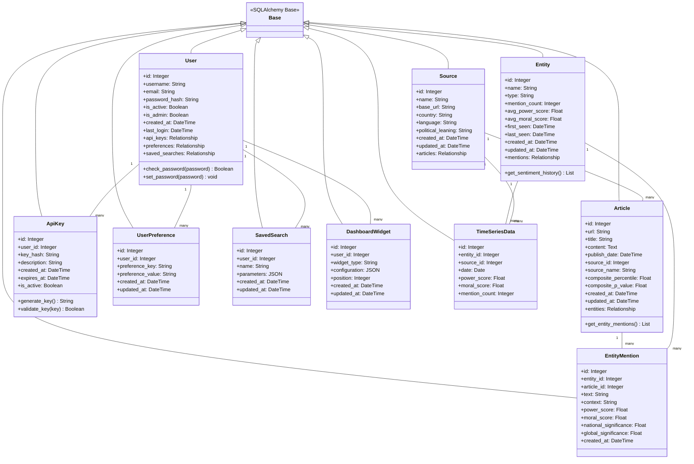
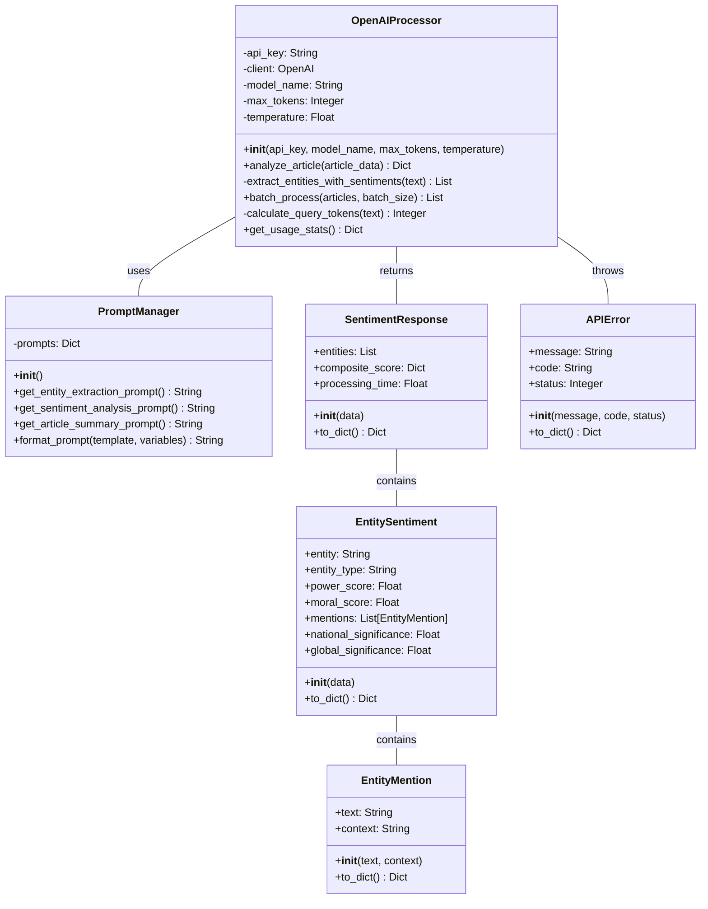
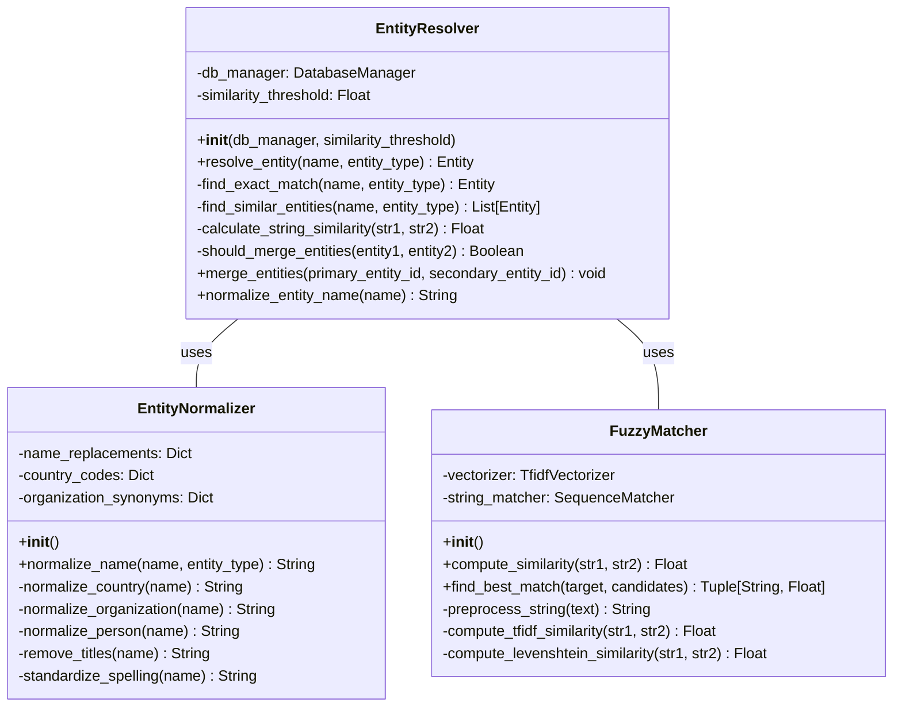
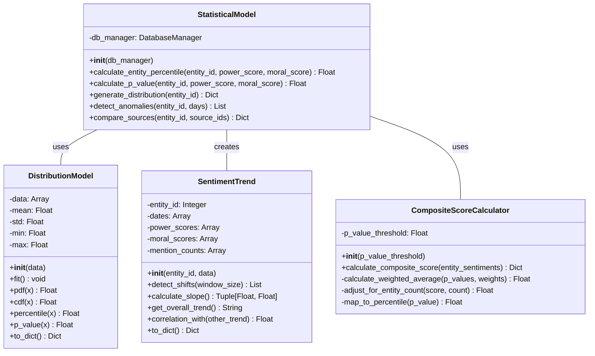
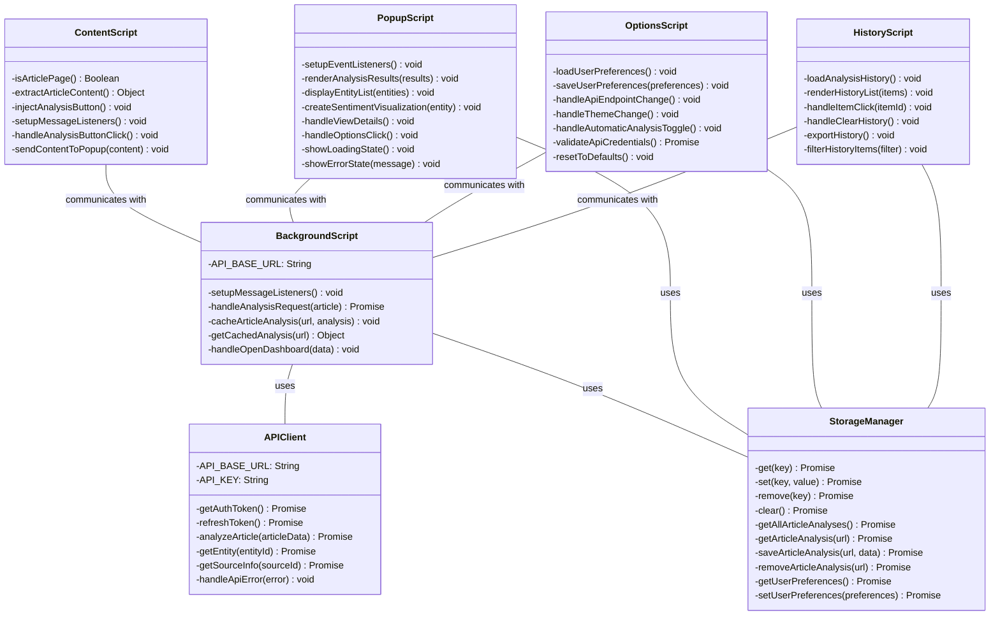
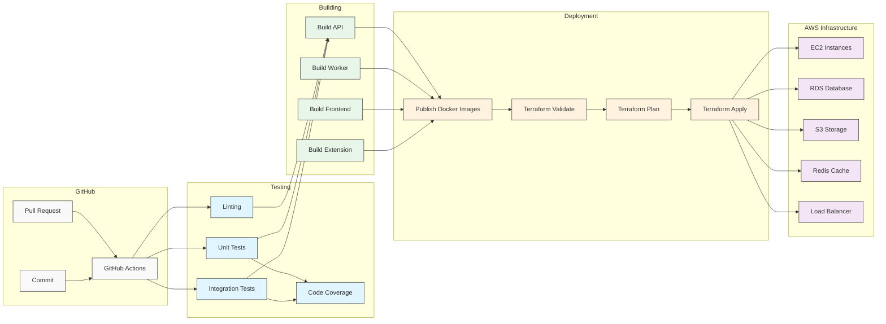

# News Bias Analyzer - Implementation Diagrams

This document contains detailed implementation diagrams showing the technical components, class structures, and code organization of the News Bias Analyzer system.

## Database Schema Implementation

## API Endpoint Implementation

```mermaid
classDiagram
    class APIRouter {
        <<FastAPI Router>>
    }
    
    class AuthRouter {
        +post_token(credentials) Response
        +post_api_key_token(api_key) Response
        +validate_token(token) User
    }
    
    class ArticleRouter {
        +post_analyze_article(request, session) Response
        +get_article(article_id, session) Response
        +get_recent_articles(source_id, limit, offset, session) Response
    }
    
    class EntityRouter {
        +get_entities(entity_type, limit, offset, session) Response
        +get_entity(entity_id, session) Response
        +get_entity_sentiment(entity_id, start_date, end_date, source_id, country, session) Response
    }
    
    class SourceRouter {
        +get_sources(country, political_leaning, limit, offset, session) Response
        +get_source(source_id, session) Response
        +get_source_bias(source_id, days, session) Response
    }
    
    class StatisticalRouter {
        +get_entity_distribution(entity_id, country, source_id, days, session) Response
        +get_trends(entity_ids, entity_types, days, source_id, country, session) Response
    }
    
    class ExtensionRouter {
        +post_extension_analyze(request, session) Response
        +get_extension_history(days, session) Response
    }
    
    class DashboardRouter {
        +get_dashboard_summary(session) Response
        +get_dashboard_widgets(user_id, session) Response
        +post_dashboard_widget(widget_data, user_id, session) Response
    }
    
    APIRouter <|-- AuthRouter
    APIRouter <|-- ArticleRouter
    APIRouter <|-- EntityRouter
    APIRouter <|-- SourceRouter
    APIRouter <|-- StatisticalRouter
    APIRouter <|-- ExtensionRouter
    APIRouter <|-- DashboardRouter
```

## OpenAI Processor Implementation

## Entity Resolution Implementation

## Statistical Models Implementation

## Browser Extension Implementation

## Admin Tools Implementation

```mermaid
classDiagram
    class AdminCLI {
        -config: ConfigParser
        +main() Integer
        -load_config(config_path) ConfigParser
        -setup_parsers() ArgumentParser
        -handle_db_commands(args, config) Integer
        -handle_user_commands(args, config) Integer
        -handle_monitor_commands(args, config) Integer
        -handle_validate_commands(args, config) Integer
        -handle_config_commands(args, config) Integer
    }
    
    class DatabaseManager {
        -host: String
        -port: Integer
        -dbname: String
        -user: String
        -password: String
        -engine: Engine
        -session_factory: sessionmaker
        +__init__(host, port, dbname, user, password)
        +get_session() Session
        +execute_query(query) ResultProxy
        +close() void
    }
    
    class DBMaintenance {
        +backup_database(db_manager, output_dir, tables) String
        +restore_from_backup(db_manager, backup_file, tables) void
        +cleanup_old_data(db_manager, days_threshold, dry_run) Dict
        +optimize_database(db_manager, vacuum, reindex) Dict
        +analyze_db_stats(db_manager, detailed, output_file) Dict
    }
    
    class UserManagement {
        +create_user(db_manager, username, email, password, is_admin, is_active) Tuple
        +delete_user(db_manager, username, force) Boolean
        +update_user(db_manager, username, email, password, is_admin, is_active) Boolean
        +list_users(db_manager, admin_only, active_only, output_format) List
        +create_api_key(db_manager, username, description, expires) String
        +revoke_api_key(db_manager, key_id) Boolean
        +list_api_keys(db_manager, username, include_expired, output_format) List
    }
    
    class ScraperMonitor {
        +analyze_scraper_performance(db_manager, days_back, by_source, output_dir) DataFrame
        +detect_failing_scrapers(db_manager, threshold_days, alert_email) List
        +monitor_scrapers_live(db_manager, interval, sources) void
        +repair_scraper_issues(db_manager, source, dry_run) Dict
    }
    
    class DataValidation {
        +validate_articles(db_manager, fix_issues, sample_size) Dict
        +validate_entities(db_manager, fix_issues, similarity_threshold) Dict
        +validate_mentions(db_manager, fix_issues) Dict
        +normalize_entities(db_manager, similarity_threshold, dry_run) Dict
        +generate_validation_report(db_manager, output_dir, report_format) String
    }
    
    AdminCLI -- DatabaseManager : uses
    AdminCLI -- DBMaintenance : uses
    AdminCLI -- UserManagement : uses
    AdminCLI -- ScraperMonitor : uses
    AdminCLI -- DataValidation : uses
```

## Dashboard Frontend Implementation

```mermaid
classDiagram
    class App {
        -authProvider: AuthProvider
        -theme: ThemeProvider
        -router: Router
        +render() JSX
    }
    
    class AuthProvider {
        -token: String
        -user: Object
        -isAuthenticated: Boolean
        -login(username, password) Promise
        -logout() void
        -getToken() String
        -register(userData) Promise
        -resetPassword(email) Promise
        -updateProfile(userData) Promise
    }
    
    class ApiService {
        -BASE_URL: String
        -token: String
        -getEntities(params) Promise
        -getEntity(entityId) Promise
        -getEntitySentiment(entityId, params) Promise
        -getSources(params) Promise
        -getSource(sourceId) Promise
        -getSourceBias(sourceId, params) Promise
        -getEntityDistribution(entityId, params) Promise
        -getTrends(params) Promise
        -analyzeArticle(article) Promise
        -getDashboardSummary() Promise
    }
    
    class DashboardLayout {
        -drawerOpen: Boolean
        -handleDrawerToggle() void
        -render() JSX
    }
    
    class EntityTable {
        -entities: Array
        -loading: Boolean
        -error: String
        -page: Number
        -pageSize: Number
        -fetchEntities() void
        -handlePageChange(page) void
        -handleFilterChange(filters) void
        -render() JSX
    }
    
    class SentimentChart {
        -data: Array
        -entityId: Number
        -timeRange: String
        -fetchData() void
        -renderChart() JSX
        -handleTimeRangeChange(range) void
        -exportChart() void
        -render() JSX
    }
    
    class SentimentDistributionChart {
        -data: Object
        -entityId: Number
        -sourceId: Number
        -showGlobal: Boolean
        -showNational: Boolean
        -fetchDistribution() void
        -renderDistribution() JSX
        -handleSourceChange(sourceId) void
        -toggleGlobal() void
        -toggleNational() void
        -render() JSX
    }
    
    class TrendLineChart {
        -trends: Array
        -entityIds: Array
        -days: Number
        -sourceId: Number
        -fetchTrends() void
        -renderChart() JSX
        -handleEntitySelection(entities) void
        -handleDaysChange(days) void
        -handleSourceChange(sourceId) void
        -render() JSX
    }
    
    class LoginPage {
        -username: String
        -password: String
        -error: String
        -loading: Boolean
        -handleUsernameChange(e) void
        -handlePasswordChange(e) void
        -handleSubmit(e) void
        -render() JSX
    }
    
    class Dashboard {
        -summary: Object
        -loading: Boolean
        -fetchSummary() void
        -renderWidgets() JSX
        -render() JSX
    }
    
    class EntitiesPage {
        -entities: Array
        -filters: Object
        -loading: Boolean
        -fetchEntities() void
        -handleFilterChange(filters) void
        -render() JSX
    }
    
    class EntityDetailPage {
        -entity: Object
        -sentiment: Object
        -distribution: Object
        -loading: Boolean
        -fetchEntityDetails(entityId) void
        -render() JSX
    }
    
    class SourcesPage {
        -sources: Array
        -filters: Object
        -loading: Boolean
        -fetchSources() void
        -handleFilterChange(filters) void
        -render() JSX
    }
    
    class SourceDetailPage {
        -source: Object
        -bias: Object
        -loading: Boolean
        -fetchSourceDetails(sourceId) void
        -render() JSX
    }
    
    class TrendsPage {
        -trends: Object
        -selectedEntities: Array
        -timeRange: String
        -sourceId: Number
        -loading: Boolean
        -fetchTrends() void
        -handleEntitySelection(entities) void
        -handleTimeRangeChange(range) void
        -handleSourceChange(sourceId) void
        -render() JSX
    }
    
    class AnalyzePage {
        -url: String
        -title: String
        -text: String
        -source: String
        -results: Object
        -loading: Boolean
        -handleSubmit() void
        -handleClear() void
        -renderResults() JSX
        -render() JSX
    }
    
    App -- AuthProvider : contains
    App -- DashboardLayout : renders
    DashboardLayout -- Dashboard : renders
    DashboardLayout -- EntitiesPage : renders
    DashboardLayout -- EntityDetailPage : renders
    DashboardLayout -- SourcesPage : renders
    DashboardLayout -- SourceDetailPage : renders
    DashboardLayout -- TrendsPage : renders
    DashboardLayout -- AnalyzePage : renders
    LoginPage -- AuthProvider : uses
    Dashboard -- ApiService : uses
    EntitiesPage -- ApiService : uses
    EntitiesPage -- EntityTable : contains
    EntityDetailPage -- ApiService : uses
    EntityDetailPage -- SentimentChart : contains
    EntityDetailPage -- SentimentDistributionChart : contains
    SourcesPage -- ApiService : uses
    SourceDetailPage -- ApiService : uses
    TrendsPage -- ApiService : uses
    TrendsPage -- TrendLineChart : contains
    AnalyzePage -- ApiService : uses
```

## Continuous Integration/Deployment Implementation

