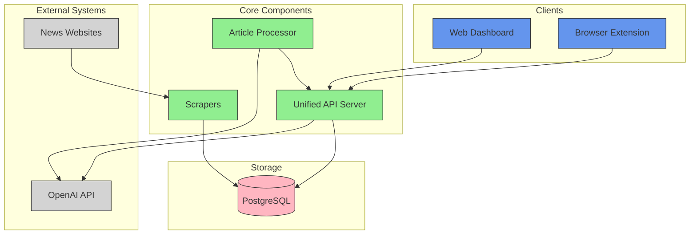
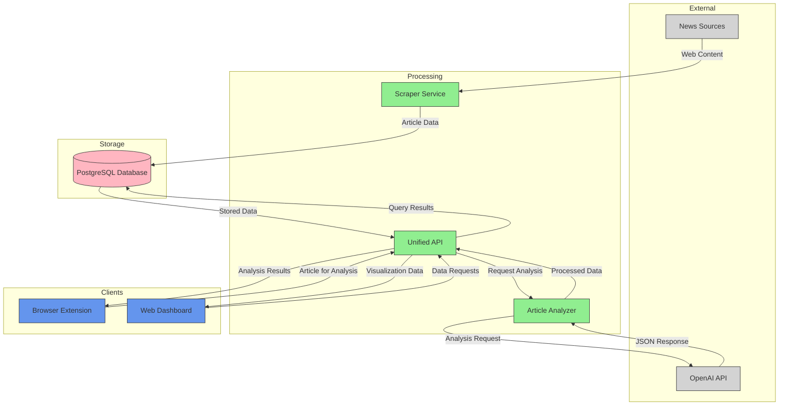
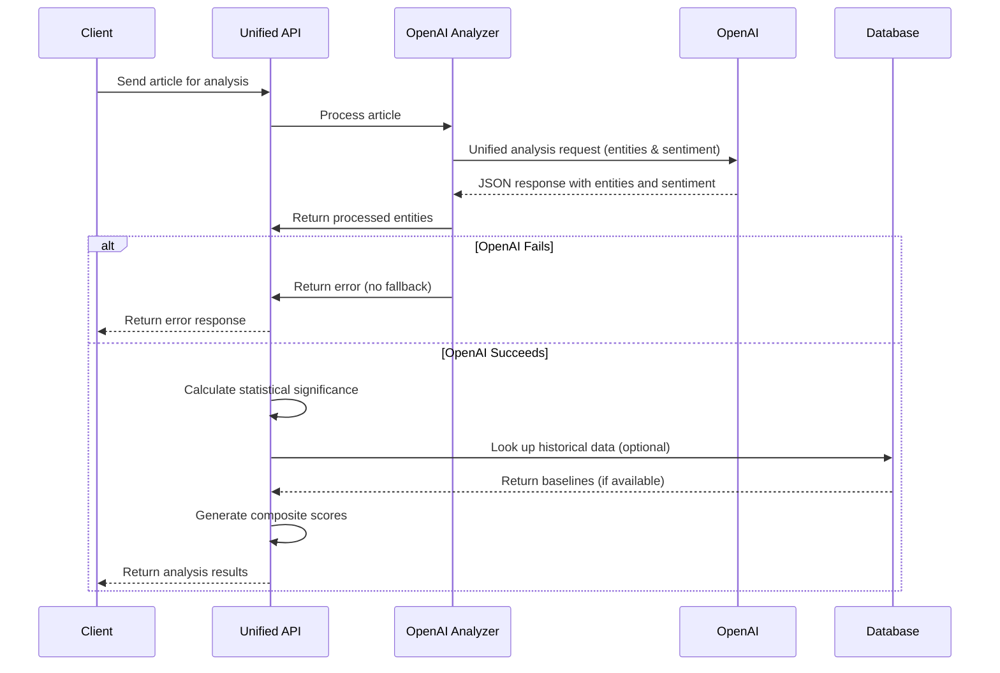
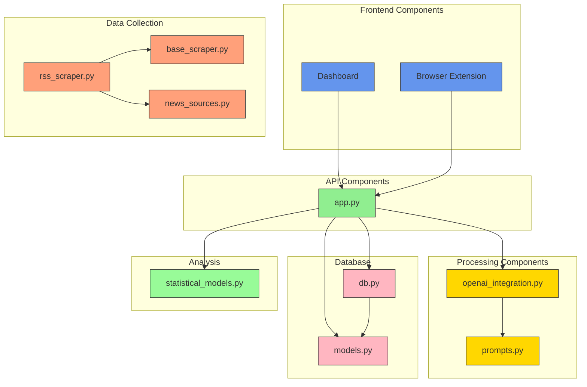
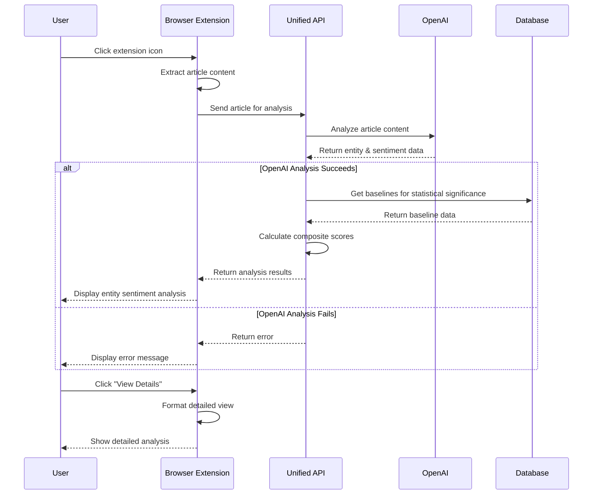

# News Bias Analyzer - Simplified Architecture Diagrams

This document contains architectural diagrams showing the simplified structure of the News Bias Analyzer system after consolidation.

## Simplified System Overview



## Simplified Data Flow



## Simplified Analysis Pipeline



## Component Structure



## Simplified Operation Flow

```mermaid
graph TD
    Start([Start]) --> RunCommand{Command}
    
    RunCommand -->|api| StartAPI[Start API Server]
    RunCommand -->|dashboard| StartDashboard[Start Dashboard]
    RunCommand -->|all| StartAll[Start API & Dashboard]
    RunCommand -->|scraper| RunScraper[Run News Scraper]
    RunCommand -->|analyze| RunAnalyzer[Run Article Analyzer]
    RunCommand -->|setup| SetupEnvironment[Set Up Environment]
    RunCommand -->|stop| StopAll[Stop All Components]
    
    StartAPI --> CheckOpenAI{OpenAI Available?}
    
    CheckOpenAI -->|Yes| UseOpenAI[Use OpenAI for Analysis]
    CheckOpenAI -->|No| ShowWarning[Show Warning]
    
    UseOpenAI --> ServerRunning[API Server Running]
    ShowWarning --> ServerRunning
    
    StartDashboard --> DashboardRunning[Dashboard Running]
    
    StartAll --> StartAPI
    StartAll --> StartDashboard
    
    RunScraper --> ScrapeArticles[Scrape News Articles]
    ScrapeArticles --> SaveArticles[Save to Database]
    
    RunAnalyzer --> CheckOpenAIKey{OpenAI Key Set?}
    CheckOpenAIKey -->|No| ShowKeyError[Show API Key Error]
    CheckOpenAIKey -->|Yes| AnalyzeArticles[Analyze with OpenAI]
    AnalyzeArticles --> SaveAnalysis[Save Analysis to DB]
    
    SetupEnvironment --> SetupPython[Set Up Python Environment]
    SetupPython --> SetupDatabase[Set Up Database]
    SetupDatabase --> SetupDashboard[Set Up Dashboard]
    
    StopAll --> StopAPI[Stop API Server]
    StopAll --> StopDashboard[Stop Dashboard]
    
    ServerRunning --> End([End])
    DashboardRunning --> End
    SaveArticles --> End
    SaveAnalysis --> End
    ShowKeyError --> End
    SetupDashboard --> End
    StopDashboard --> End
    
    classDef start fill:#6495ED,stroke:#333,stroke-width:1px;
    classDef end fill:#6495ED,stroke:#333,stroke-width:1px;
    classDef command fill:#FFD700,stroke:#333,stroke-width:1px;
    classDef process fill:#90EE90,stroke:#333,stroke-width:1px;
    classDef decision fill:#FFA07A,stroke:#333,stroke-width:1px;
    classDef state fill:#FFB6C1,stroke:#333,stroke-width:1px;
    
    class Start,End start;
    class RunCommand,CheckOpenAI,CheckOpenAIKey decision;
    class StartAPI,StartDashboard,StartAll,RunScraper,RunAnalyzer,SetupEnvironment,StopAll command;
    class UseOpenAI,ShowWarning,ScrapeArticles,SaveArticles,ShowKeyError,AnalyzeArticles,SaveAnalysis,SetupPython,SetupDatabase,SetupDashboard,StopAPI,StopDashboard process;
    class ServerRunning,DashboardRunning state;
```

## Browser Extension Flow



## Unified Architecture Pattern

This simplified architecture follows a more straightforward pattern:

1. **Single API Server**: One unified API (`app.py`) handles all endpoints
2. **OpenAI-Only Analysis**: All analysis is performed through OpenAI with no random fallbacks
3. **Simple Command Interface**: A single `run.sh` script handles all operations
4. **Minimal Dependencies**: Direct connections between components with fewer abstractions
5. **Clear Data Flow**: Straightforward flow from clients through API to database and OpenAI