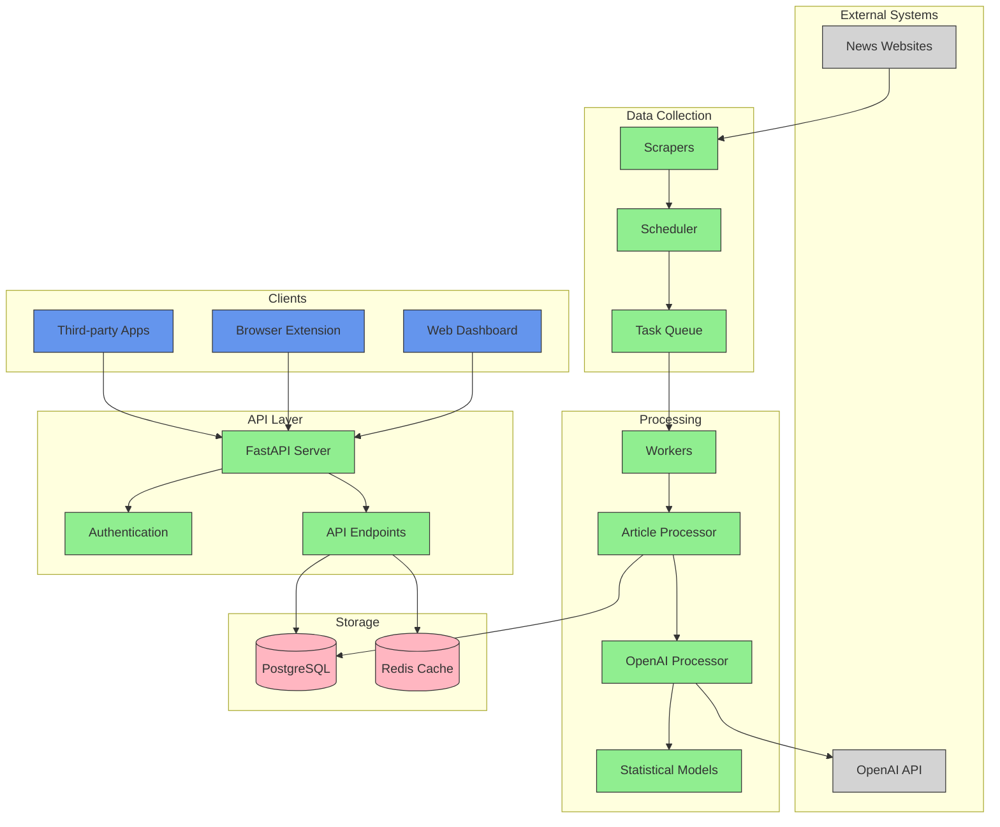
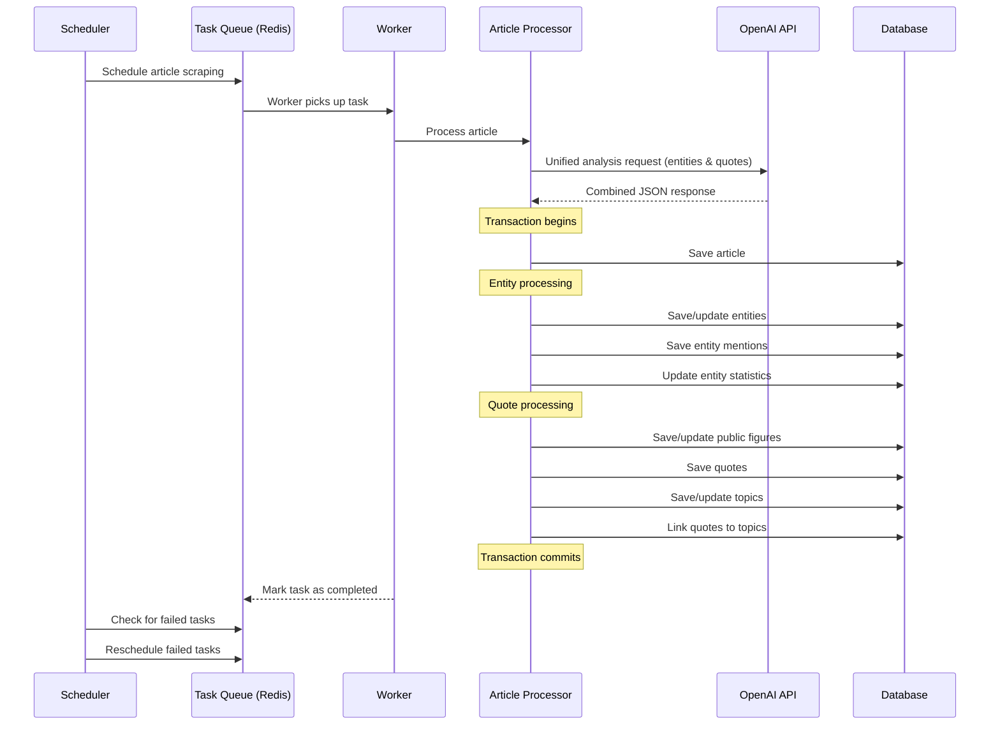
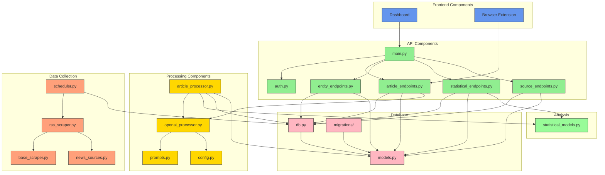
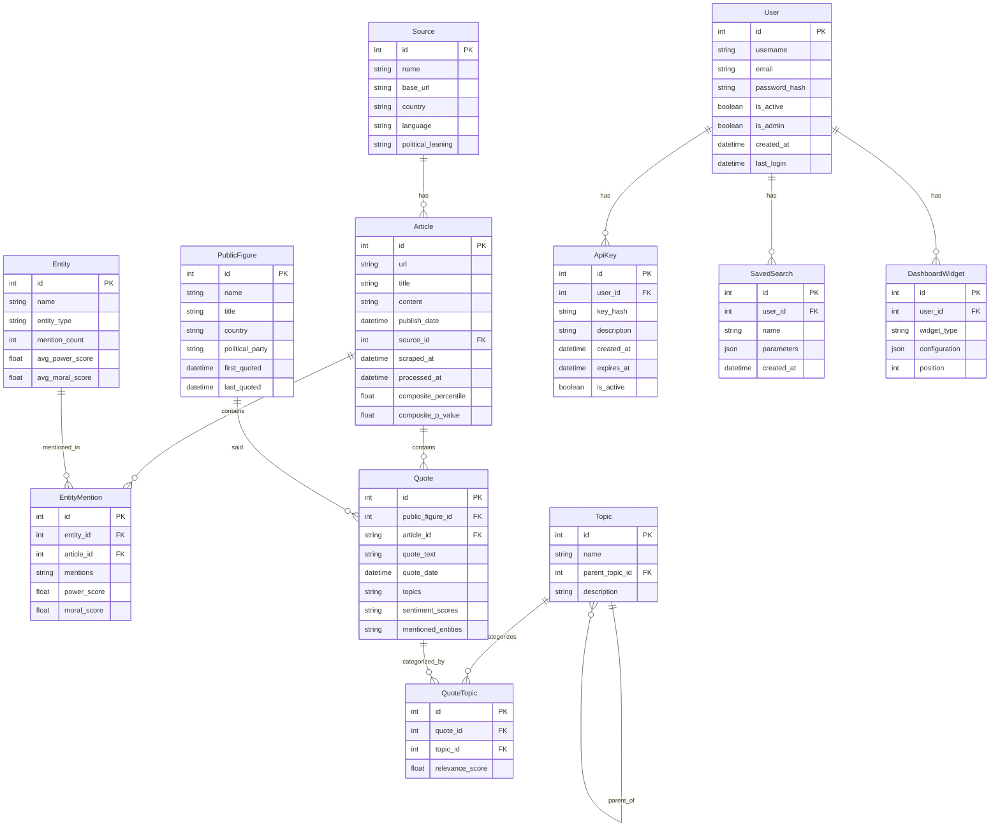
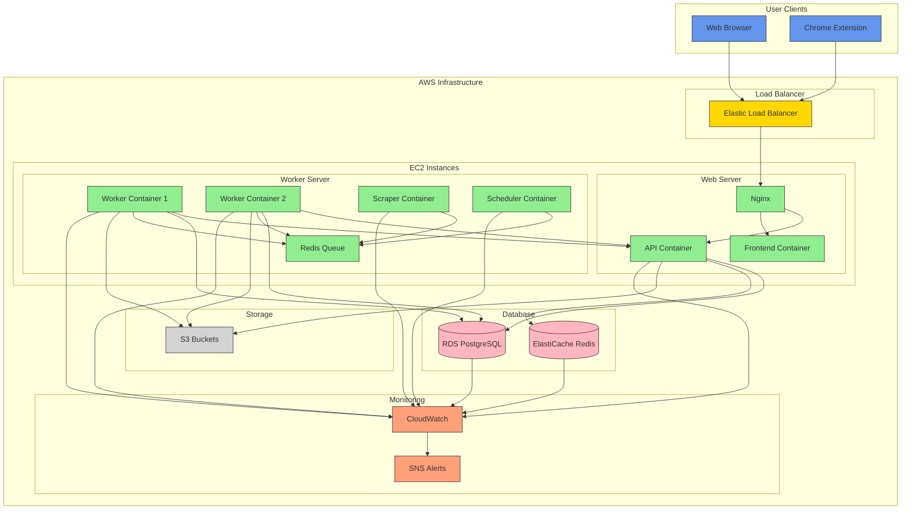
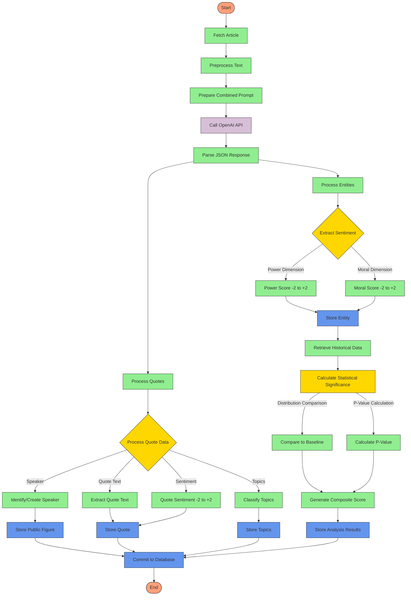
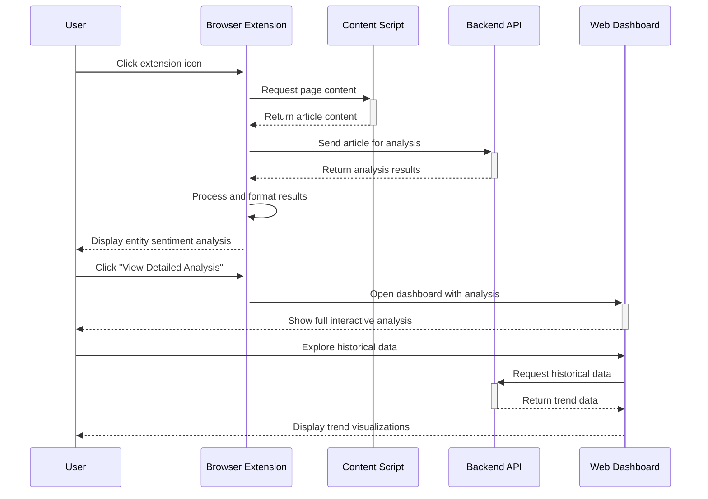

# News Bias Analyzer - System Architecture Diagrams

This document contains architectural diagrams showing the structure, dependencies, and data flows of the News Bias Analyzer system.

## System Overview



## Integrated Data Processing Pipeline



## Component Dependencies



## Database Schema



## Deployment Architecture



## Integrated Analysis Process Flow



## Browser Extension Flow



## Admin Tools Flow

```mermaid
graph TD
    Start([Start]) --> CLICommand[Run Admin CLI Command]
    
    CLICommand --> |db| DBMaintenance{Database Maintenance}
    CLICommand --> |user| UserManagement{User Management}
    CLICommand --> |monitor| ScraperMonitoring{Scraper Monitoring}
    CLICommand --> |validate| DataValidation{Data Validation}
    CLICommand --> |config| ConfigManagement{Config Management}
    
    DBMaintenance --> |backup| BackupDB[Backup Database]
    DBMaintenance --> |restore| RestoreDB[Restore Database]
    DBMaintenance --> |cleanup| CleanupOldData[Clean Old Data]
    DBMaintenance --> |optimize| OptimizeDB[Optimize Database]
    DBMaintenance --> |stats| ShowDBStats[Show DB Statistics]
    
    UserManagement --> |create| CreateUser[Create User]
    UserManagement --> |delete| DeleteUser[Delete User]
    UserManagement --> |update| UpdateUser[Update User]
    UserManagement --> |list| ListUsers[List Users]
    UserManagement --> |apikey| ManageAPIKeys[Manage API Keys]
    
    ScraperMonitoring --> |performance| AnalyzePerformance[Analyze Performance]
    ScraperMonitoring --> |detect-failures| DetectFailures[Detect Failures]
    ScraperMonitoring --> |live| MonitorLive[Monitor Live]
    ScraperMonitoring --> |repair| RepairIssues[Repair Issues]
    
    DataValidation --> |articles| ValidateArticles[Validate Articles]
    DataValidation --> |entities| ValidateEntities[Validate Entities]
    DataValidation --> |mentions| ValidateMentions[Validate Mentions]
    DataValidation --> |normalize| NormalizeEntities[Normalize Entities]
    DataValidation --> |report| GenerateReport[Generate Report]
    
    ConfigManagement --> |show| ShowConfig[Show Config]
    ConfigManagement --> |set| SetConfig[Set Config Value]
    ConfigManagement --> |reset| ResetConfig[Reset to Defaults]
    
    BackupDB --> End([End])
    RestoreDB --> End
    CleanupOldData --> End
    OptimizeDB --> End
    ShowDBStats --> End
    
    CreateUser --> End
    DeleteUser --> End
    UpdateUser --> End
    ListUsers --> End
    ManageAPIKeys --> End
    
    AnalyzePerformance --> End
    DetectFailures --> End
    MonitorLive --> End
    RepairIssues --> End
    
    ValidateArticles --> End
    ValidateEntities --> End
    ValidateMentions --> End
    NormalizeEntities --> End
    GenerateReport --> End
    
    ShowConfig --> End
    SetConfig --> End
    ResetConfig --> End
    
    classDef start fill:#FFA07A,stroke:#333,stroke-width:1px;
    classDef end fill:#FFA07A,stroke:#333,stroke-width:1px;
    classDef command fill:#6495ED,stroke:#333,stroke-width:1px;
    classDef category fill:#FFD700,stroke:#333,stroke-width:1px;
    classDef action fill:#90EE90,stroke:#333,stroke-width:1px;
    
    class Start,End start;
    class CLICommand command;
    class DBMaintenance,UserManagement,ScraperMonitoring,DataValidation,ConfigManagement category;
    class BackupDB,RestoreDB,CleanupOldData,OptimizeDB,ShowDBStats,CreateUser,DeleteUser,UpdateUser,ListUsers,ManageAPIKeys,AnalyzePerformance,DetectFailures,MonitorLive,RepairIssues,ValidateArticles,ValidateEntities,ValidateMentions,NormalizeEntities,GenerateReport,ShowConfig,SetConfig,ResetConfig action;
```