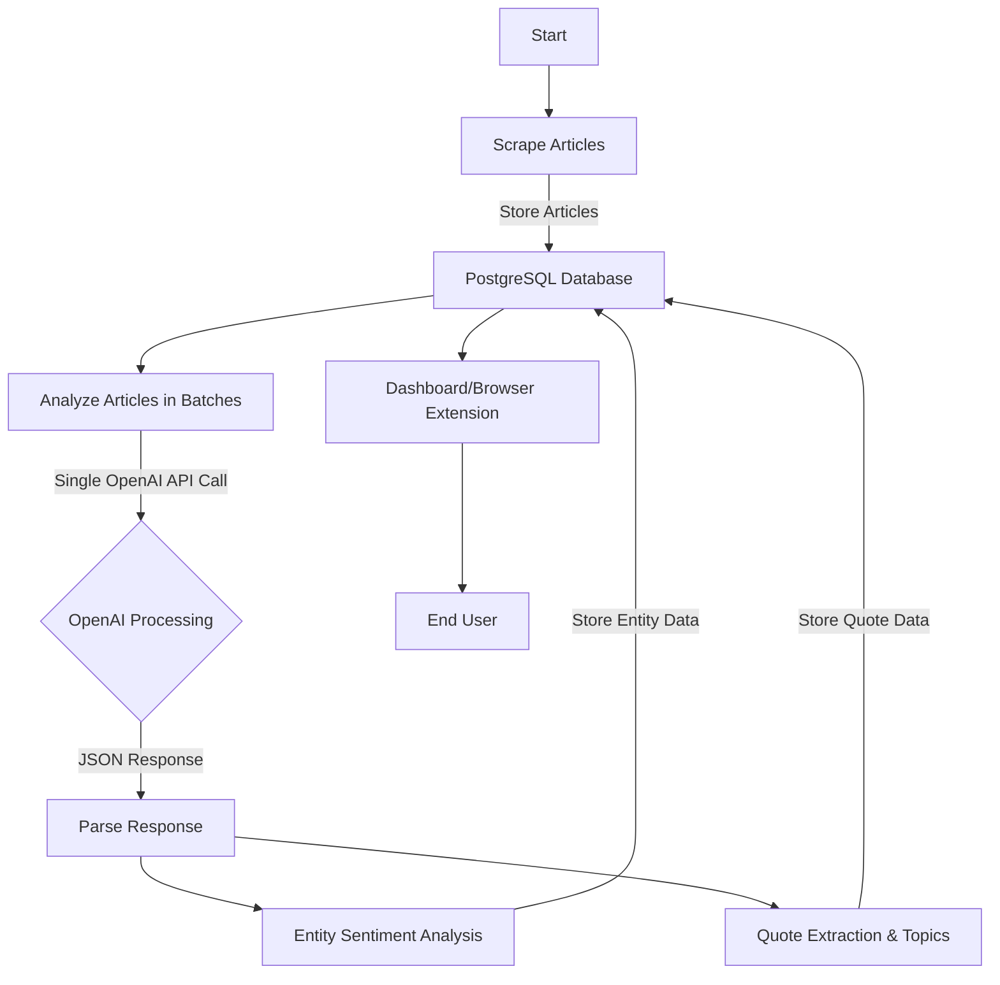
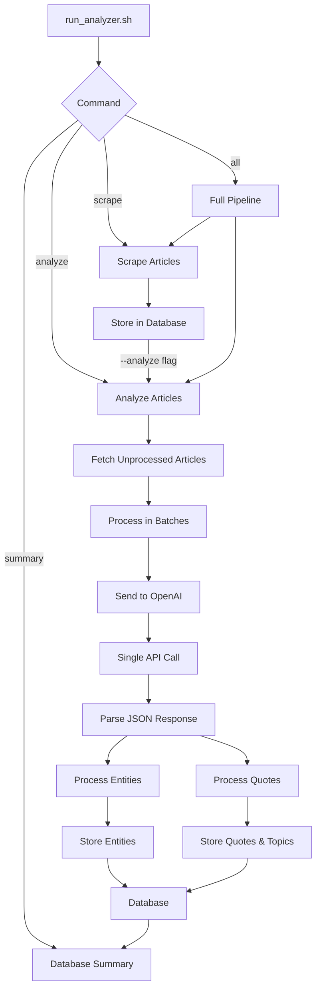
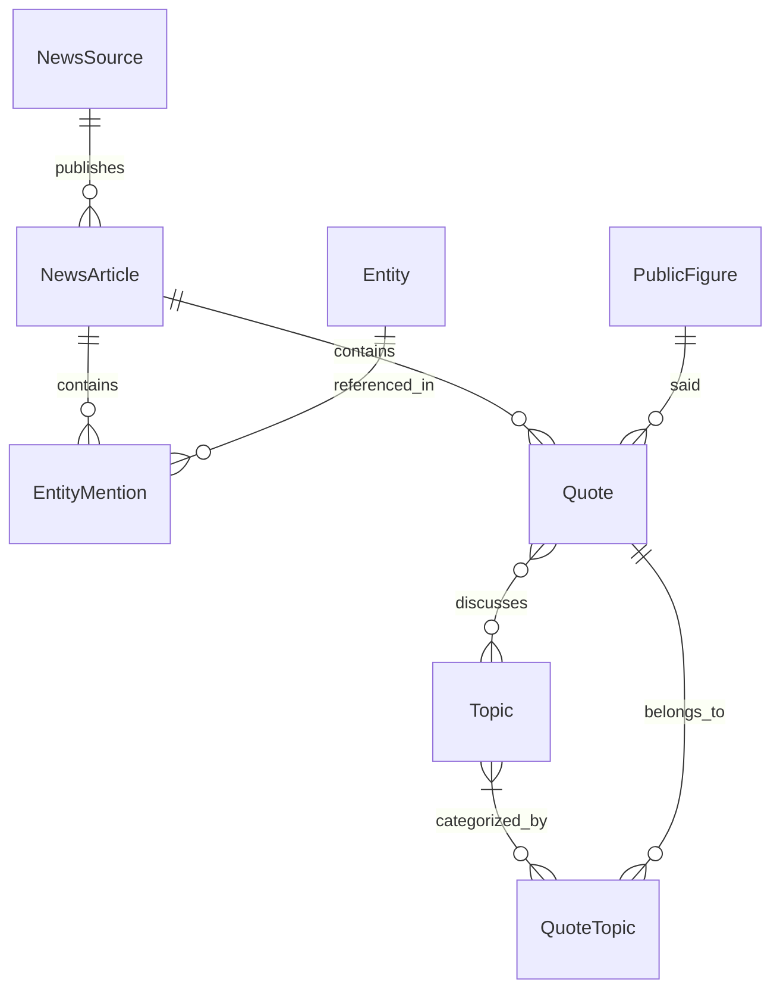
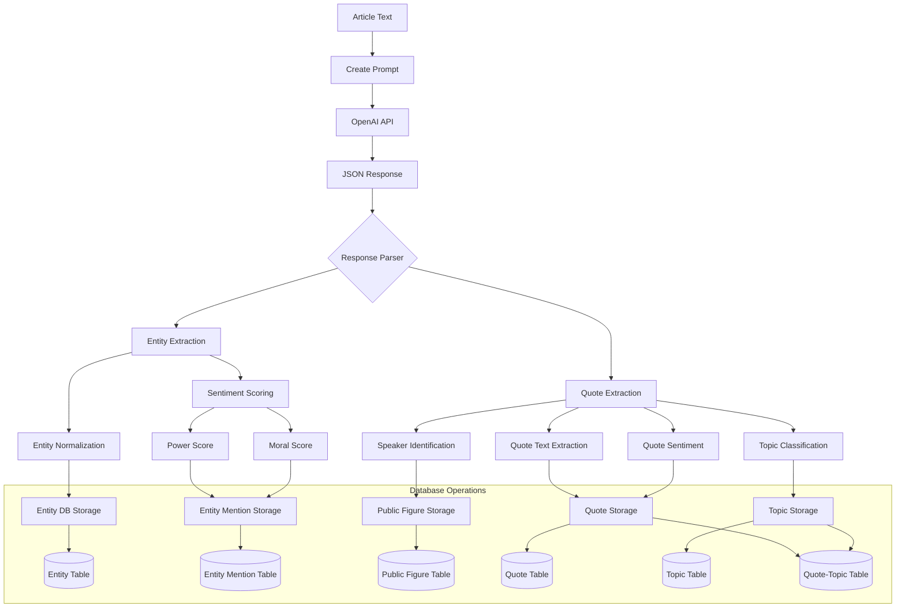
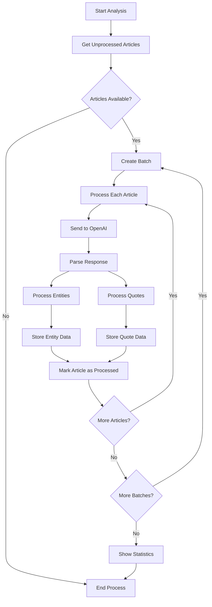

# News Bias Analyzer: Updated Data Flow Diagrams

This document provides updated flow diagrams showing the current state of the News Bias Analyzer pipeline after recent improvements.

## Main Data Flow

## Consolidated Script Architecture

## Data Model Relationships

## Analysis Process Flow

## Batch Processing Flow

## Key Improvements

1. **Fully Integrated Analysis**: Entity sentiment analysis and quote extraction are performed in a single OpenAI API call within a unified process, significantly reducing costs and complexity.

2. **Batch Processing**: Articles are processed in configurable batches with transaction management, improving reliability, performance, and resumability.

3. **Simplified Command Interface**: Streamlined to just 4 main commands:
   - `scrape`: Scrape articles from news sources
   - `analyze`: Analyze articles for both entities and quotes
   - `all`: Run complete pipeline 
   - `summary`: Show database summary

4. **Comprehensive Quote Tracking**: Extracts quotes with speaker attribution, topic classification, and sentiment analysis, creating a historical record of statements.

5. **Robust Error Handling**: Added multi-level error handling, transaction management, and automatic resumption of interrupted processes.

6. **Support for All News Sources**: The system can now use all available news sources (50+), not just the default 4.

7. **Improved Database Schema**: Enhanced data model with better relationships between entities, quotes, and topics.

## Typical Workflow

1. User runs `./run_analyzer.sh all`
2. System sets up Docker and PostgreSQL if needed
3. Articles are scraped from all available news sources
4. Articles are stored in the database
5. Articles are analyzed in batches:
   - A single OpenAI prompt extracts both entities and quotes
   - Entities and their sentiment scores are stored
   - Quotes, speakers, topics, and sentiment are stored
6. Database summary is displayed
7. Data is available for the dashboard or browser extension